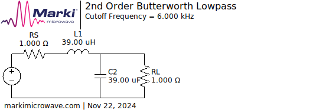

# Amplifier
There are three options to supply audio to the amplifier:
* Analog
  * Might suffer from noise, ground loops
  * Very versatile.  Allows to connect any audio source.
  * Simple software implementation, maybe even no software implementation at all.
* PWM
  * Fully digital signal path
  * CPU intensive, limited resolution and sampling rate
* I²S
  * Fully digital signal path
  * Less CPU intensive, higher resolution and sampling rate
  * An MCU with I²S output is needed

After much consideration, the analog input is chosen.

## Analog input
An alternative to generating audio by PWM is using a single ended class D amplifier with analog audio input.  The MP7740 and MP7741 are such devices.  They're not available on JLCPCB.
Their minimum input voltage is 9.5V, which is already quite high.  We might want to test the circuit with lower supply voltages to avoid burning the amplifier.

### Modulator options
[SLAA701A LC Filter Design](https://www.ti.com/lit/an/slaa701a/slaa701a.pdf) explains the difference between the BD-modulator and the AD-modulator.  Both modulators have a positive and A
an inverted output.  The difference is only in the inverted output.  For our application we can ignore the difference when using only the positive output.

Most recent class-D amplifiers use the BD-modulator.  The TPA3138D2 is such an amplifier.  It can be used as single ended, but TI [doesn't really recommend it](https://e2e.ti.com/support/audio-group/audio/f/audio-forum/927759/tpa3138d2-using-btl-amplifier-for-se-outputs-for-cost-savings). 
* TPA3118D2 (older) -> TPA3128D2 (upgrade): 2x 30W
    * JLCPCB

The following older class-D amplifiers use the AD-modulator:
* TPA3120D2
* TPA3121D2 (available on JLCPCB)
* TPA3123D2
* TPA3124D2 (compatible with the TPA3121D2, only a small difference in the mute control)

## PWM input
A fully digital signal path is used.  The ESP32 generates the PWM signal using the [PWM-audio component](https://docs.espressif.com/projects/esp-iot-solution/en/latest/audio/pwm_audio.html).  The PWM signal is fed to a half-bridge IC, which drives the speaker.

### Audio bandwidth
The minimum audio bandwidth for AM is around 3kHz.  The Qodosen DX-286 has a configurable audio bandwidth of 3kHz, 4kHz, 6kHz or even 8kHz.
So the minimum audio sampling rate should be at least 16kHz.

### PWM frequency & resolution
[PWM Distortion Analysis](http://www.openmusiclabs.com/learning/digital/pwm-dac/pwm-distortion-analysis/).  Key takeaways are :
* PWM is multiplication of your audio signal with a square wave at the PWM frequency
* Harmonics of the PWM frequency are generated
* Harmonics of the audio frequency are generated as well, because the audio signal isn't continuous, but a series of samples, sampled at the PWM frequency.
* Phase correct PWM has less (around 25dB) distortion than fast PWM
* PWM frequency should be at least 7 to 10 times the audio frequency

The ESP32 audio component only supports up to 48kHz PWM frequency, which is only three times the sampling frequency.

### Half-bridge IC
[CSD97395Q4M](https://www.ti.com/lit/ds/symlink/csd97395q4m.pdf)
* 60A peak current.  It's available on JLCPCB.
* The minimum ON-time is 40ns.
* €1.80 is quite expensive, but that's about the cheapest you can get for a half-bridge IC.

### Reconstruction filter

The PWM signal is fed to a low-pass filter to remove the PWM frequency and its harmonics.  The filter is a 2nd order Butterworth filter with a cutoff frequency of 6kHz, designed by [Markimicrowave](https://markimicrowave.com/technical-resources/tools/lc-filter-design-tool/).  The filter is designed for a 1ohm load impedance.
* L = 39µH → L = Wuerth 744776139 (lowest loss at 13.56MHz)
* C = 39µF → 4x 10µF, 1210 package

## I2S input
* TAS2770
  * minimum sampling rate is 44.1kHz.  48kHz is supported.
  * 20W output power
* TAS2505 has a class-D amplifier with I²S input. 
  * only 2W output power, so an extra half-bridge IC is needed.
  * Support for 8kHz to 96kHz sampling rates
  * available on JLCPCB (€1.50)
  * also has an analog input
  * the output pins don't seem to be perfectly differential according to the screenshots in the TI forum.
  * only 2W output power
* MAX98357A has a class-D amplifier with I²S input.  It's available on JLCPCB.
  * much more expensive than the TAS2505
  * simpler to use than the TAS2505