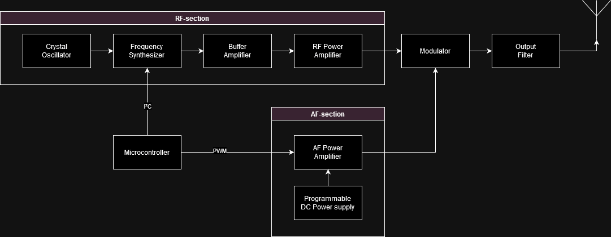

# AMT5000-24
5W AM-transmitter for the 13.56MHz ISM-band

# Design choice
* DfM (Design for Manufacturability)
  * Use of COTS components
  * Use of standard PCB manufacturing techniques, no coil winding
  * Use of standard assembly techniques, preferably SMT
  * Ease of patching : SOIC instead of TSSOP
* Frequency : 13.56 MHz
  * ISM-band
  * Falls within SW-broadcast band, so AM-radios can be used
  * Antenna-length for a dipole is reasonable
  * [Carrier current](https://en.wikipedia.org/wiki/Carrier_current) is possible.  The mains power impedance isn't too low at this frequency.
  * 13.56MHz Class-E power amplifier designs is not uncommon
* Output power : 5W
  * remains within QRP limits

# Block diagram

High-level AM-generator block diagram

## RF-section (Radio-frequency)
* [Crystal Oscillator & frequency synthesizer](./oscillator.md)
* [Buffer amplifier & RF-power amplifier](./rf-amp.ipynb)

## AF-section (Audio-frequency)
* Audio PWM-modulator using H-bridge IC (as on TR6000) : CSD97395Q4M
* [PWM-generator by ESP32 output](https://docs.espressif.com/projects/esp-iot-solution/en/latest/audio/pwm_audio.html)

## Modulator
Modulation happens by the output of the PWM-generator being used as power supply for the RF-power amplifier.

## Output filter
The output filter suppresses the harmonics of the switching frequency of the RF-power amplifier.

# Implementation
Instead of building a complete transmitter at once.  Prototyping will be done in stages.  The sections mentioned above will be designed as 50x50mm PCBs.  These will be tested separately and then combined onto a double sided 100x100mm FR4.  This allows us to:
* Test the sections separately and in combination with each other.
* A cheap double sided FR4 PCB can be used as a carrier for the sections.  This allows us to test the sections in combination with each other.
* Use the cheap PCB manufacturing services, like JLCPCB.  The 6 layer 50x50mm PCBs are only $2/5pcs.
* JST-PH will be used as connectors between the sections.
  * JST-PH for power
  * JST-PH for signals

The disadvantage is that the sections will be connected by wires, but we can use u.fl coax cables for signals.  All components should be SMD, not through hole, because of the carrier PCB.

# Why AM and not FM?
* Higher field strengths are allowed
* Receiver bandwidths are narrower (lower noise floor)
* AM is superior to FM under weak-signal conditions
* AM-band has more usable channels than FM
* construction is less critical because frequencies are low.
* only simple test equipment is needed